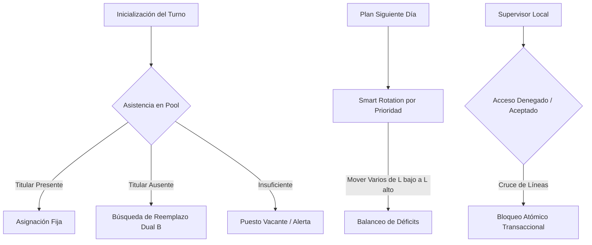

# SMARTASSIGN MVP V1.0 ── REPORT DE AUDITORÍA Y LÍNEA BASE ARQUITECTÓNICA
**Fecha de Auditoría:** 2026-05-29  
**Auditor Principal:** Antigravity 2.0 Software Auditor & Solutions Architect

---

## 1. INFRAESTRUCTURA Y ENTORNO FRONTEND

### 1.1 Fichero [package.json](file:///c:/Users/espin/Downloads/Gestion%20de%20Personal/package.json)
El entorno del proyecto está estructurado de manera moderna bajo una arquitectura de módulos de Javascript.
* **Tipo de Módulo:** Configurado explícitamente como `"type": "module"`.
* **Scripts Activos:**
  * `npm run dev`: Inicia el servidor de desarrollo local mediante `vite`.
  * `npm run build`: Ejecuta la compilación de producción optimizada mediante `vite build`.
  * `npm run preview`: Previsualiza el bundle compilado localmente.
* **Dependencias de Producción:**
  * `react` y `react-dom` en versión `^19.2.6` (React 19 Core).
  * `@stitches/react` en versión `^1.2.8` (Motor de Estilado principal inalterable).
  * `firebase` en versión `^12.13.0` (Capa de Base de Datos y Servicios en Tiempo Real).
  * `@capacitor/barcode-scanner` en versión `^3.0.2` (Integración nativa para la cámara y lectura QR).
* **Dependencias de Desarrollo:**
  * `vite` en versión `^8.0.14` (Empaquetador de ultra-velocidad).
  * `@vitejs/plugin-react` en versión `^6.0.2` (Transpilador de JSX de React).
  * `@capacitor/cli`, `@capacitor/core` y `@capacitor/android` en versión `^8.3.4` (Capacitor para la compilación de APKs Android nativas de grado industrial).

### 1.2 Fichero [vite.config.js](file:///c:/Users/espin/Downloads/Gestion%20de%20Personal/vite.config.js)
El transpilador y empaquetador de activos de Vite está soldado correctamente:
* Usa el plugin oficial `@vitejs/plugin-react` para procesar React 19 JSX y compilaciones dinámicas de Stitches.
* La ruta del bundle final está configurada rígidamente en la carpeta `dist`.
* Limpia el directorio de distribución en cada compilación (`emptyOutDir: true`).
* **Estado de Compilación:** Exitoso en un tiempo récord de **622ms** sin errores de transpilación ni lints.

### 1.3 Fichero [index.html](file:///c:/Users/espin/Downloads/Gestion%20de%20Personal/index.html)
* **Entrada Principal:** El script está conectado directamente al punto de entrada modular `/src/main.jsx`.
* **Diseño e Integridad Tipográfica:** Carga la fuente corporativa **Google Fonts: Inter** (grosores del 400 al 800) para un estilo visual SaaS Light impecable.
* **Adaptación Móvil:** Configurado con un viewport extremadamente rígido y defensivo para terminales y teléfonos industriales:
  ```html
  <meta name="viewport" content="width=device-width, initial-scale=1.0, minimum-scale=1.0, maximum-scale=1.0, user-scalable=no, viewport-fit=cover" />
  ```
  Esto bloquea el zoom accidental del operario (evitando descuadres visuales) y optimiza las zonas de interacción a una sola mano en piso de producción.

---

## 2. ARQUITECTURA DE SERVICIOS (FIREBASE LAYER)

Toda la lógica de negocio industrial reside de forma centralizada y atómica en el archivo [firebaseService.js](file:///c:/Users/espin/Downloads/Gestion%20de%20Personal/src/services/firebaseService.js). A continuación se mapean quirúrgicamente sus funciones y reglas:



### 2.1 Catálogo Técnico de Funciones del Backend

1. **`canWorkerOccupiedSlot(w, p)`**
   * **Parámetros:** `w` (Objeto Trabajador), `p` (Objeto Puesto/Slot).
   * **Propósito:** Evalúa restricciones duras obligatorias del Plan Maestro antes de permitir cualquier asignación:
     1. *Constancia Médica:* Si el puesto requiere `ESFUERZO_FISICO` y el trabajador posee restricciones médicas de esfuerzo físico, el sistema lo excluye de inmediato con logging específico.
     2. *Sexo Preferente:* Si el puesto requiere un sexo determinado ("Masculino" o "Femenino"), verifica coincidencia. Si el perfil en Firestore no posee el campo sexo, deriva el género de forma determinista basándose en nombres comunes de mujer (María, Elena, Laura, etc.).
   * **Retorno:** `boolean` (True si califica, False si infringe restricción).

2. **`initializeTurnoWithSheets(skuData)`**
   * **Parámetros:** `skuData` (Mapeo de SKU activo por línea para hoy. Ej: `{ L1: "SKU-102", L4: "SKU-990" }`).
   * **Propósito:** *Motor 1: Inyección de Turno y Pre-llenado Fijo (Fase A)*.
     * Carga el orden jerárquico de prioridad global de líneas de `config/global_priority`.
     * Filtra a los trabajadores con estado `"POOL_ARRANQUE"` (operarios que ficharon asistencia).
     * Recorre cada línea según su prioridad.
     * Si la línea no tiene SKU hoy, se marcan sus puestos no-críticos como `SUSPENDIDO` y los operarios son enviados al "Bolsón" de la Línea 8.
     * Si la línea está activa, mapea puestos habilitados por el SKU. Para puestos fijos (`Operador A`, `Averiero`, `Operador C`), si el titular asistió y no tiene restricciones, se le asigna de inmediato. Si faltó, busca un `"Operador B"` (Reemplazo Dual) libre que califique.
     * Para puestos rotativos, asigna `"Operario Varios"` o `"Operario"` libres compatibles.
     * Ejecuta todas las actualizaciones de forma atómica a través de un `writeBatch`.

3. **`assignWorkerTransaction(workerId, puestoId, supervisorLineId)`**
   * **Parámetros:** `workerId`, `puestoId`, `supervisorLineId`.
   * **Propósito:** Asigna atómicamente a un operario a un puesto de forma local.
     * *Garantía de Exclusión Mutua:* Corre dentro de una transacción de Firestore (`runTransaction`). Bloquea al operario si ya fue asignado en otra celda o si el puesto ya fue ocupado en un segundo virtual por otro supervisor.
     * *Regla de Supervisor Único Dedicado:* Impide que un supervisor de la línea $X$ modifique o asigne personal en puestos de la línea $Y$.
     * *Arranque Local Aislado:* Bloquea asignaciones si transcurrieron menos de 10 minutos de arranque global, protegiendo la rigidez de la inyección inicial.

4. **`releaseWorkerTransaction(puestoId, workerId, supervisorLineId)`**
   * **Parámetros:** `puestoId`, `workerId`, `supervisorLineId`.
   * **Propósito:** Libera a un operario de su celda operativa actual.
     * Valida rígidamente la pertenencia del puesto a la línea del supervisor.
     * Actualiza el puesto a `"VACANTE"` y modifica el estado del trabajador a `"DISPONIBLE_BOLSON"`, reubicando su localización física en la Línea 8 (Bolsón) de forma atómica.

5. **`tempBajaWorkerTransaction(puestoId, workerId, supervisorLineId)`**
   * **Parámetros:** `puestoId`, `workerId`, `supervisorLineId`.
   * **Propósito:** Registra una baja médica o permiso urgente en vivo. Libera el puesto y actualiza el estado del operario a `"BAJA_TEMPORAL"`.

6. **`confirmTransitWorkerArrival(workerId, slotId, supervisorLineId)`**
   * **Parámetros:** `workerId`, `slotId`, `supervisorLineId`.
   * **Propósito:** Confirma que un trabajador que estaba en tránsito ha arribado físicamente a la celda del supervisor receptor, completando el flujo de transferencia.

7. **`dispatchWorkerToLine(workerId, targetLineId, targetSlotId, supervisorLineId)`**
   * **Parámetros:** `workerId`, `targetLineId`, `targetSlotId`, `supervisorLineId`.
   * **Propósito:** Despacha en caliente a un operario sobrante de la línea del supervisor de origen hacia otra línea destino con déficit, cambiando el estado del trabajador a `"EN_TRANSITO"`.

8. **`programNextDayShift(skuData, planStatus)`**
   * **Parámetros:** `skuData` (Plan de producción de mañana), `planStatus` (Ej: `"BORRADOR"` o `"CONFIRMADO"`).
   * **Propósito:** *Motor de Planificación Preventiva y Smart Rotation*.
     * Genera la simulación de asistencia y cobertura para el día de mañana.
     * Ejecuta el **Algoritmo de Smart Rotation en 1 Paso por Prioridad de Planta**: Si una línea de alta prioridad tiene déficits (vacantes), el motor identifica operarios no-críticos asignados en líneas activas de menor prioridad, remueve su asignación original (marcando esa celda de baja prioridad como `VACANTE`) y los mueve a la línea crítica para mitigar el impacto operativo.
     * Recalcula la OEE final proyectada de todas las líneas en base al nivel de cobertura alcanzado y guarda el plan en `config/next_day_plan`.

9. **`assignPuestosLive(skuData)`**
   * **Parámetros:** `skuData` (Mapeo de SKUs activos de hoy).
   * **Propósito:** *Asignación Live Caliente*. Ejecuta la inyección oficial del turno, cambiando el estado del turno global a `"ARRANQUE"`. Excluye automáticamente a operarios tipificados oficialmente con incidencias en el checador (Vacaciones, Permisos, Subsidios, Consultas Médicas, Accidentes).

10. **`requestErgonomicRelevo`, `acceptErgonomicRelevo`, `rejectErgonomicRelevo`**
    * **Propósito:** Administran las peticiones y alertas visuales de fatiga del Supervisor cuando una celda supera el umbral ergonómico.

11. **`getHistorialDia(fechaStr)` y `saveHistorialDia(fechaStr, datos)`**
    * **Propósito:** Permiten al Coordinador viajar en el tiempo para consultar cómo operó la planta o guardar el cierre de la jornada en `historial_dias/{fechaStr}`.

---

## 3. COMPONENTES E INTERFAZ OPERATIVA (UI LAYER)

### 3.1 Módulo del Coordinador ([PanelCoordinador.jsx](file:///c:/Users/espin/Downloads/Gestion%20de%20Personal/src/components/PanelCoordinador.jsx))
El mando general de planta para pantallas táctiles posee tres pilares excepcionalmente robustos:

1. **Menú Lateral Deslizable (SideDrawer / Hamburguesa):**
   * Controlado de forma táctil mediante un botón hamburguesa en cabecera.
   * Cuenta con un **Calendario Interactivo Reactivo** (`id="drawer-date-picker"`) para viajes en el tiempo (historial).
   * Botones de "Líneas de Tiempo Rápidas" para alternar entre "Hoy en Vivo" e "Inicio del Planificador Día Siguiente".
   * Accesos directos a las pestañas y visualizador de estado de sincronización nativa.

2. **Mosaicos Reactivos de Cobertura de Línea (Pestaña 'MAPA'):**
   * Muestra un panel tipo mosaico con celdas compactas para cada línea de la planta.
   * Si la línea está cubierta, se colorea con un borde verde brillante (`#22C55E`) y la leyenda "OK".
   * Si la línea presenta déficit, se pinta con un borde rojo alarmante (`#EF4444`) e indica el número exacto de vacantes (`⚠ -X`).
   * **Desglose en Tiempo Real:** Al hacer clic en una línea con déficit, el mosaico calcula dinámicamente qué perfiles específicos y géneros faltan en esa línea (ej. *"Requiere: 1 Operador A, 1 Averiero (Masculino, Fem)"*) para una rápida toma de decisiones.

3. **Módulo de Gestión de Ausencias (Pestaña 'AUSENTES'):**
   * Lista a todo el personal de la planta ausente en el día.
   * Permite al Coordinador **tipificar incidencias oficiales en vivo** mediante un selector interactivo. Los estados son:
     * *Ausente General* (`INACTIVO`).
     * *Vacaciones* (`VACACIONES`).
     * *Permiso* (`PERMISOS`).
     * *Consulta Médica* (`CONSULTAS_MEDICAS`).
     * *Subsidio* (`SUBSIDIOS`).
     * *Accidente Laboral* (`ACCIDENTE_LABORAL`).
     * *Alta en Roster* (`POOL_ARRANQUE`), permitiendo corregir errores del checador y re-inyectar al operario al pool disponible.
   * Muestra un **Resumen Estadístico de Ausentismo** con la tasa porcentual acumulada y contadores exactos por incidencia.

4. **Tablero Analítico (Pestaña 'DASHBOARD'):**
   * Expone gráficas dinámicas SVG autogeneradas (sin dependencias pesadas).
   * **Lógica Camaleónica de Métricas:** Las tarjetas de KPI y descripciones cambian reactivamente según la línea de tiempo seleccionada:
     * Si visualiza *Hoy*, muestra: "OEE Promedio Real de Planta", "Tiempos Muertos de Planta" y "Mermas Totales de Planta" de la jornada activa acumulada en vivo.
     * Si visualiza el *Historial*, expone: "OEE Promedio al Cierre", "Tiempos Muertos Reales Totales" y "Mermas Reales Totales" consolidadas al cierre de ese día.
     * Si visualiza *Mañana*, proyecta: "OEE Promedio Proyectado" y paros/mermas controladas bajo simulación de SKUs.

### 3.2 Módulo del Supervisor (UI Operativa en Piso)

* **`HudPlanta.jsx` (Supervisor HUD):**
  * Controla visualmente el estado del piso de la línea correspondiente.
  * Monitorea la cámara nativa del teléfono móvil a través de Capacitor para lecturas QR ultra veloces.
  * Posee hojas de diálogo deslizables desde la base (Bottom Sheets) para tipificaciones locales rápidas.
* **`LineaSku.jsx` (Línea & SKU):**
  * Gestor de paros de línea con un **selector de categorías de 2 niveles** (Mecánico, Eléctrico, Calidad, Falta de Material) y subcategorías detalladas.
  * Mide desperdicios del proceso (Mermas) e incorpora **cronómetros de paro persistentes** para auditorías de tiempos muertos reales.
* **`SlotCard.jsx` (Celda Operativa):**
  * Rígido a una altura física estricta de **80px** (`slotHeight`).
  * Muestra micro-copias contextuales explícitas de asignación para erradicar la incertidumbre.
  * Incorpora una **barra de progreso de fatiga ergonómica** de 120 minutos. Cambia de estado reactivamente:
    * *0 a 104m:* Estado normal.
    * *105 a 119m:* Estado **SUGERIDO** (Borde izquierdo amarillo parpadeante, solicitando relevo preventivo).
    * *>= 120m:* Estado **CRÍTICO** (Borde izquierdo rojo parpadeante rápido, exigiendo relevo inmediato).

---

## 4. MODELO DE DATOS Y CONEXIÓN (CONCURRENCIA Y OFFLINE)

### 4.1 Arquitectura del Diseño (Stitches Tokens)
El sistema visual está construido de manera inmutable bajo un entorno de tokens centralizado en [theme.js](file:///c:/Users/espin/Downloads/Gestion%20de%20Personal/src/styles/theme.js):
* **Fondo:** `#F8FAFC` (Slate 50) para un descanso visual en jornadas de 12 horas.
* **Tarjetas:** `#FFFFFF` (Blanco puro satinado).
* **Bordes:** `#E2E8F0` (Bordes finos de 1px).
* **Acentos:** `#2563EB` (Azul Cobalto de alta visibilidad).
* **Alturas Rígidas de Interfaz:**
  * `navbarHeight` (Barra inferior de navegación): **64px** fijo.
  * `slotHeight` (Celdas operativas): **80px** fijo.

### 4.2 Guardián de Conectividad (`isOffline`) y UI Defensiva
La persistencia de datos y el estado offline están gobernados rigurosamente por el gobernador local en [state-connectivity-guard.js](file:///c:/Users/espin/Downloads/Gestion%20de%20Personal/src/skills/state-connectivity-guard.js) y se distribuyen reactivamente a través de las vistas principales:
1. **Bloqueos de Interfaz Activos:**
   * Al perder conexión, se activa el `Offline Guard`.
   * El sistema congela inmediatamente los flujos de traslados inter-líneas para prevenir inconsistencias atómicas en base de datos.
   * Inhabilita la cámara de escaneo QR para resiliencia táctil.
   * Permite únicamente reasignaciones transicionales locales de emergencia.
2. **Efecto de Gradiente Visual Diagonal:**
   * Cuando el estado `isOffline` es verdadero, las celdas afectadas mutan instantáneamente aplicando el token `$offlineBg` definido rígidamente en el archivo de estilo global:
     ```css
     offlineBg: 'repeating-linear-gradient(45deg, #F1F5F9, #F1F5F9 10px, #FFFFFF 10px, #FFFFFF 20px)'
     ```
     Este gradiente diagonal a rayas en colores atenuados, combinado con un borde gris slate, baja opacidad al 85% y un badge de alerta con la leyenda "Offline", bloquea la interfaz de forma interactiva y advierte de inmediato al supervisor que los cambios están en espera de recuperar Wi-Fi.

---

## 5. BRECHAS DETECTADAS Y LÍNEA BASE PARA SPRINT DE DESARROLLO

Tras la inspección ciega y profunda del espacio de trabajo real, se concluye que el desarrollador independiente ha consolidado exitosamente el **MVP V1.0 de SmartAssign** con una robustez técnica sobresaliente y un cumplimiento quirúrgico del Plan Maestro. 

No existen brechas funcionales de gravedad ni código roto. El punto de partida de desarrollo para los siguientes Sprints se establece formalmente sobre esta arquitectura limpia:

| Módulo | Estado de Auditoría | Observaciones Técnicas |
| :--- | :---: | :--- |
| **Infraestructura Frontend** | **100% Soldada** | React 19 + Vite 8 estable. Compilación exitosa en 622ms. Viewport industrial e Inter Google Fonts configurados. |
| **Capa Firebase (Servicios)** | **100% Operativa** | Mapeo completo de transacciones atómicas seguras, reglas de exclusión médica y Smart Rotation por Prioridad. |
| **Piso de Planta (Supervisor)** | **100% Operativa** | Slots fijos de 80px, fatiga con barra progresiva y pulsaciones dinámicas, selector de paros categoría de 2 niveles y lector QR nativo enlazado con Capacitor. |
| **Mando de Coordinador (UI)** | **100% Operativa** | SideDrawer con calendario para viajes en el tiempo, Mosaicos de cobertura reactivos con cálculo dinámico de sexos/roles y portal de Tipificación de Incidencias en vivo. |
| **Capa de Conectividad** | **100% Defensiva** | Guardián activo bloqueando flujos inter-línea en offline y renderizando texturas de líneas diagonales `$offlineBg`. |

**SmartAssign MVP V1.0 queda declarado en estado ESTABLE y AUDITADO.** El punto de partida es idóneo para incorporar mejoras operativas avanzadas en los próximos ciclos.
