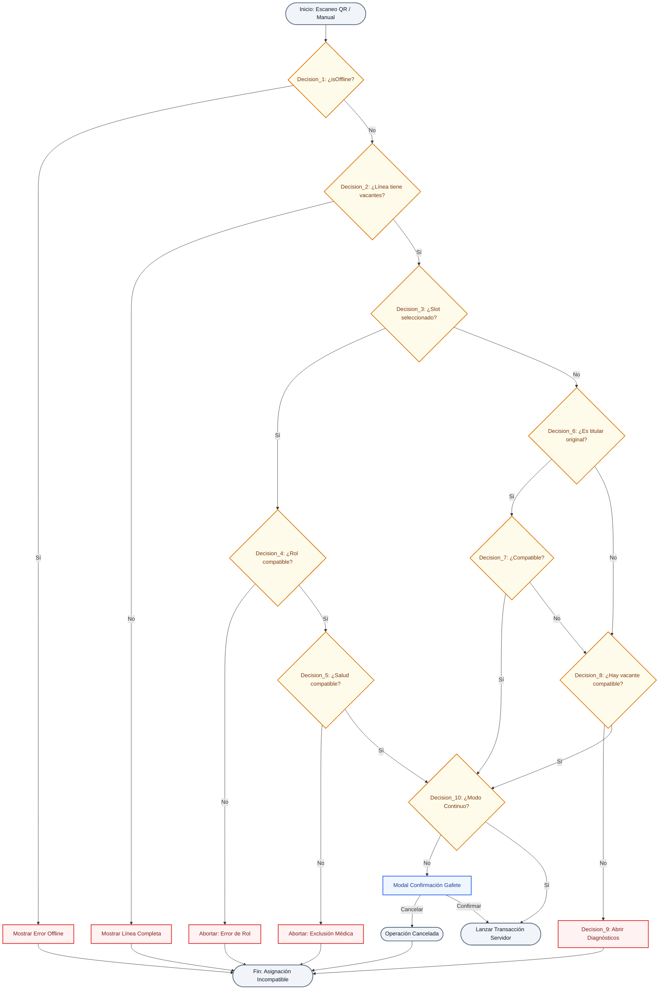
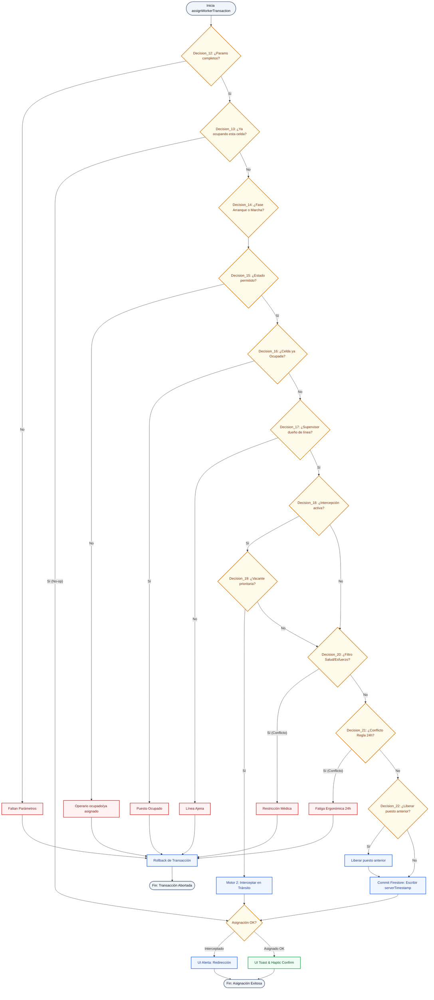

# Arquitectura de Nodos y Mapa de Decisiones Real: SmartAssign Engine

Este documento describe con precisión de ingeniería todos los **nodos de decisión** reales codificados en la lógica de cliente ([HudPlanta.jsx](file:///c:/Users/espin/Downloads/Gestion%20de%20Personal/src/components/HudPlanta.jsx)) y backend transaccional ([firebaseService.js](file:///c:/Users/espin/Downloads/Gestion%20de%20Personal/src/services/firebaseService.js)).

---

## 1. Catálogo Completo de Nodos de Decisión (29 Nodos)

A partir del análisis exhaustivo del código fuente, el sistema ejecuta de forma secuencial y atómica las siguientes compuertas lógicas agrupadas en tres capas operativas:

### Capa A: Interfaz Cliente & Escaneo/Búsqueda (`HudPlanta.jsx`)
1. **Decision_1: ¿Modo Offline Activo?** (`isOffline`)
   * *Verdadero*: Bloquea el escáner QR y el buscador manual, mostrando el banner *"Modo Offline Activo: El escáner QR está inhabilitado"*. Redirige a **Fin: Asignación Incompatible**.
   * *Falso*: Continúa al escaneo.
2. **Decision_2: ¿Hay Puestos Vacantes en la Línea?**
   * *Falso*: Bloquea el scanner mostrando el toast *"Línea Completa: No hay puestos vacantes en esta línea"*. Redirige a **Fin: Asignación Incompatible**.
   * *Verdadero*: Habilita la entrada de datos.
3. **Decision_3: ¿Existe Selección Previa de Celda?** (`selectedSlotId`)
   * *Verdadero (Selección Directa)*: Evalúa la compatibilidad específica de inmediato:
     * **Decision_4: ¿Rol del operario compatible con la celda?** (`isWorkerRoleCompatibleWithSlot(worker.role, selectedSlot.tipoPuesto)`)
       * *Falso*: Aborta la asignación, genera haptic de error y muestra error de Rol en UI. Redirige a **Fin: Asignación Incompatible**.
     * **Decision_5: ¿Ficha de salud del operario compatible?** (`canWorkerOccupiedSlot(worker, selectedSlot)`)
       * *Falso*: Aborta la asignación, genera haptic de error y muestra error de Salud en UI. Redirige a **Fin: Asignación Incompatible**.
     * *Si es compatible*: Continúa a la comprobación de escaneo (Decision_10).
   * *Falso (Matchmaking Automático)*: Ejecuta `findBestSlotForWorker`:
     * **Decision_6: ¿El operario es titular planificado de alguna vacante en la línea?** (`slot.idWorkerOriginal === worker.id`)
       * *Verdadero*:
         * **Decision_7: ¿Es compatible el titular con su puesto original?** (Rol y Salud).
           * *Verdadero*: Selecciona este puesto.
           * *Falso*: Salta a Decision_8.
       * *Falso*:
         * **Decision_8: ¿Hay alguna vacante compatible general en toda la línea?** (Rol + Género + Ficha Médica).
           * *Verdadero*: Selecciona la vacante de mayor prioridad.
           * *Falso*:
             * **Decision_9: ¿Abrir Diagnóstico por Incompatibilidad?** Abre el **Drawer de Diagnóstico de Incompatibilidades** (`setSheetMode('diagnostics')`), listando el checklist detallado de conflictos (Rol, Ficha Médica, Género e Historial 24h) para cada vacante. Redirige a **Fin: Asignación Incompatible**.
4. **Decision_10: ¿Modo de Escaneo Continuo Activo?** (`continuousScanMode`)
   * *Verdadero (Arranque Rápido)*: Dispara directamente la transacción al servidor (`assignWorkerTransaction`).
   * *Falso (Escaneo Único)*: Muestra el modal de confirmación visual del gafete con foto en alta resolución:
     * **Decision_11: ¿Confirmar Asignación por Supervisor?** (Confirmación manual).
       * *Confirmado*: Lanza la transacción.
       * *Cancelado*: Limpia estados. Redirige a **Fin: Asignación Incompatible**.

### Capa B: Transacción de Servidor (`assignWorkerTransaction`)
5. **Decision_12: ¿Parámetros Obligatorios Presentes?** (`!workerId || !puestoId || !supervisorLineId`)
   * *Verdadero*: Aborta y lanza una excepción. Redirige a **Rollback de Transacción** y luego a **Fin: Transacción Abortada**.
6. **Decision_13: ¿El operario ya está ocupando esa misma celda?**
   * *Verdadero*: Retorna éxito inmediato sin reescribir (No-op de base de datos). Redirige a **Fin: Asignación Exitosa**.
7. **Decision_14: ¿Fase de Arranque o de Marcha?**
   * Evalúa el tiempo transcurrido desde `shiftStartTimestamp` en `shift_status`.
   * **Menor o igual a 10 min**: Fase de Arranque Local Aislado (desactiva intercepciones de otras líneas).
   * **Mayor a 10 min**: Fase de Marcha Activa (habilita intercepciones de pasillo).
8. **Decision_15: ¿Estado del Operario Permitido para la Fase?**
   * *En Fase de Marcha*: Muta solo si está en `"POOL_ARRANQUE"` o `"DISPONIBLE_BOLSON"`.
   * *En Fase de Arranque*: Muta si está en `"POOL_ARRANQUE"`, `"DISPONIBLE_BOLSON"`, `"INACTIVO"` y `"ASIGNADO"`.
   * *Incompatible*: Aborta y lanza error. Redirige a **Rollback de Transacción** y luego a **Fin: Transacción Abortada**.
9. **Decision_16: ¿Celda de Destino ya Ocupada?** (`puestoData.idWorkerCurrent !== null`)
   * *Verdadero*: Aborta transacción. Redirige a **Rollback de Transacción** y luego a **Fin: Transacción Abortada**.
10. **Decision_17: ¿Permiso de Supervisor en Línea Propia?** (`puestoData.lineId !== supervisorLineId`)
    * *Verdadero (Línea Ajena)*: Aborta por seguridad. Redirige a **Rollback de Transacción** y luego a **Fin: Transacción Abortada**.
11. **Decision_18: ¿Se permite Intercepción en Caliente?** (`isMarchaPhase && allowInterception`)
    * *Verdadero*:
      * **Decision_19: ¿Hay vacantes en líneas de mayor prioridad?** (Revisa `global_priority` y compatibilidad médica).
        * *Verdadero*: Modifica al operario a estado `"EN_TRANSITO"`, redirigiendo su asignación. Retorna `intercepted: true` al cliente y redirige a **Fin: Asignación Exitosa**.
12. **Decision_20: ¿Conflicto de Restricción Médica de Esfuerzo Físico?**
    * *Verdadero*: Aborta y lanza excepción de salud. Redirige a **Rollback de Transacción** y luego a **Fin: Transacción Abortada**.
13. **Decision_21: ¿Conflicto de Regla de 24 Horas?** (`workerData.lastActivity === puestoData.activityName`)
    * *Verdadero*: Aborta y lanza excepción ergonómica. Redirige a **Rollback de Transacción** y luego a **Fin: Transacción Abortada**.
14. **Decision_22: ¿Liberar Puesto Local Anterior?** (Si el operario estaba asignado a otra celda local)
    * *Verdadero*: Libera el puesto anterior colocándolo en `"VACANTE"` o `"ALERTA_VACANTE"`.
    * Ambos caminos proceden a **Commit Firestore** y luego a **Fin: Asignación Exitosa**.

### Capa C: Relevos, Cascadeo & Contingencias (`acceptErgonomicRelevo` & otros)
15. **Decision_23: ¿Confirmar Arribo de Trabajador en Tránsito?** (`confirmTransitWorkerArrival`)
    * *Verdadero*: El supervisor confirma el arribo físico; el estado del operario pasa de `"EN_TRANSITO"` a `"ASIGNADO"`. Redirige a **Fin: Arribo Confirmado**.
16. **Decision_24: ¿Línea de Origen Bloqueada (L7)?** (En `getRelocationDestination`)
    * *Verdadero*: Retorna `"fixed"` (permanecer en puesto, L7 no rota). Redirige a **Fin: Cascadeo Finalizado**.
17. **Decision_25: ¿Reubicación Local de Operario Relevado?** (Buscar otro fatigado local en la misma línea)
    * *Verdadero*: Retorna `"local"` hacia esa celda y el operario desalojado entra al ciclo de cascadeo. Redirige a **Fin: Cascadeo Finalizado**.
18. **Decision_26: ¿Reubicación Inter-Línea por Prioridad?** (Déficit en otras líneas según prioridad de origen)
    * *Verdadero*: Retorna `"transit"` hacia la línea externa (el operario pasa a `"EN_TRANSITO"`). Redirige a **Fin: Cascadeo Finalizado**.
    * *Falso (Fallback Definitivo)*: Procede a la Decision_27.
19. **Decision_27: ¿Detección de Bucle Infinito en Cascadeo?** (¿Puesto ya visitado en la cadena en memoria?)
    * *Verdadero / Falso (Fallback)*: Rompe el ciclo recursivo y envía al operario directamente de regreso al Bolsón L8. Redirige a **Fin: Cascadeo Finalizado**.
20. **Decision_28: ¿Rechazar Relevo Ergonómico?** (`rejectErgonomicRelevo`)
    * *Confirmado*: Devuelve al relevista en tránsito al Bolsón L8 y actualiza `rejectedWorkerIds` del puesto fatigado. Redirige a **Fin: Relevo Anulado**.
21. **Decision_29: ¿Activar Paro Técnico / Modo Preparación?** (`startLineParoTransaction`)
    * *Confirmado*: Los operarios fijos críticos permanecen congelados; los puestos varios se vacían de inmediato y sus operarios generales son enviados a L8 (Bolsón) en tránsito. Redirige a **Fin: Paro Registrado**.

*Nota: Los nodos marcados con prefijo "Decision_" siguen un ciclo de vida estrictamente unidireccional para garantizar la integridad transaccional.*

---

## 2. Diagramas de Flujo de Decisiones (Mermaid.js)

Para maximizar la legibilidad y evitar desbordamientos visuales dentro de Obsidian, el flujograma global se divide en tres diagramas independientes y autocontenidos:

### Capa A: Validaciones en Cliente (HudPlanta.jsx)


### Capa B: Transacción Firestore en Servidor (assignWorkerTransaction)


### Capa C: Relevos, Cascadeo, Paros y Contingencias

```mermaid
flowchart TD
    classDef startEnd fill:#F1F5F9,stroke:#64748B,stroke-width:2px,color:#0F172A;
    classDef nodeProc fill:#EFF6FF,stroke:#2563EB,stroke-width:2px,color:#1E3A8A;
    classDef nodeDec fill:#FFFBEB,stroke:#D97706,stroke-width:2px,color:#78350F;
    classDef nodeErr fill:#FEF2F2,stroke:#DC2626,stroke-width:2px,color:#7F1D1D;
    classDef nodeSuccess fill:#F0FDF4,stroke:#16A34A,stroke-width:2px,color:#14532D;

    subgraph Relevos [Módulo de Relevos y Cascadeo]
        Relevo_Start([Inicio Relevo]) --> D24{Decision_24: ¿Línea es L7?}
        D24 -- Sí --> Action_L7Fixed[Reubicación: fixed - L7 no rota]
        D24 -- No --> D27{Decision_27: ¿Ciclo infinito?}
        D27 -- Sí --> Action_Infinite[Romper Bucle: Regreso a Bolsón L8]
        D27 -- No --> D25{Decision_25: ¿Reubicación local fatigado?}
        D25 -- Sí --> Action_Local[Reubicación local y cascadeo]
        D25 -- No --> D26{Decision_26: ¿Reubicación inter-línea prioritaria?}
        D26 -- Sí --> Action_Transit[Enviar en Tránsito]
        D26 -- No --> Action_Infinite
        
        Action_L7Fixed --> End_Cascade([Fin: Cascadeo Finalizado])
        Action_Infinite --> End_Cascade
        Action_Local --> End_Cascade
        Action_Transit --> End_Cascade
    end

    subgraph Paros [Módulo de Paros Técnicos]
        Paro_Start([Inicio Paro Técnico]) --> D29{Decision_29: ¿Activar Paro?}
        D29 -- Sí --> Action_Paro[Técnicos congelados / Varios a L8]
        Action_Paro --> End_Paro([Fin: Paro Registrado])
    end

    subgraph Rechazos [Módulo de Rechazo de Relevos]
        Rechazo_Start([Inicio Rechazo Relevo]) --> D28{Decision_28: ¿Rechazar Relevista?}
        D28 -- Sí --> Action_Reject[Devolver relevista a L8 / rejectedWorkerIds]
        Action_Reject --> End_Reject([Fin: Relevo Anulado])
    end
    
    subgraph Arribos [Módulo de Arribos de Tránsito]
        Arrival_Start([Inicio Confirmación Arribo]) --> D23{Decision_23: ¿Confirmar Arribo?}
        D23 -- Sí --> Action_Confirm_Arrival[Actualizar Operario a ASIGNADO]
        Action_Confirm_Arrival --> End_Arrival([Fin: Arribo Confirmado])
    end

    class Relevo_Start,End_Cascade,Paro_Start,End_Paro,Rechazo_Start,End_Reject,Arrival_Start,End_Arrival startEnd;
    class D24,D27,D25,D26,D29,D28,D23 nodeDec;
    class Action_L7Fixed,Action_Infinite,Action_Local,Action_Transit,Action_Paro,Action_Reject,Action_Confirm_Arrival nodeProc;
```


---

## 3. Configuración Lógica del Intérprete (JSON)

Esquema JSON detallado que representa el flujo estructurado de los nodos de decisión para la integración con motores de agentes cognitivos.

```json
{
  "flowId": "smartassign-decision-engine-mvp",
  "version": "3.5.0",
  "layers": {
    "layer_client": {
      "name": "Capa A: Cliente - HudPlanta.jsx",
      "nodes": [
        {
          "id": "node_offline_check",
          "type": "ConditionNode",
          "config": { "condition": "isOffline" },
          "outputs": {
            "true": "node_fallback_offline",
            "false": "node_vacancy_check"
          }
        },
        {
          "id": "node_vacancy_check",
          "type": "ConditionNode",
          "config": { "condition": "vacantSlots.length > 0" },
          "outputs": {
            "true": "node_selection_router",
            "false": "node_fallback_full_line"
          }
        },
        {
          "id": "node_selection_router",
          "type": "ConditionNode",
          "config": { "condition": "selectedSlotId != null" },
          "outputs": {
            "true": "node_validate_direct_role",
            "false": "node_matchmaking_titular_check"
          }
        },
        {
          "id": "node_validate_direct_role",
          "type": "ValidationNode",
          "config": { "rule": "isWorkerRoleCompatibleWithSlot" },
          "outputs": {
            "true": "node_validate_direct_health",
            "false": "node_fallback_role_error"
          }
        },
        {
          "id": "node_validate_direct_health",
          "type": "ValidationNode",
          "config": { "rule": "canWorkerOccupiedSlot" },
          "outputs": {
            "true": "node_continuous_scan_check",
            "false": "node_fallback_health_error"
          }
        },
        {
          "id": "node_matchmaking_titular_check",
          "type": "ConditionNode",
          "config": { "condition": "slot.idWorkerOriginal == worker.id" },
          "outputs": {
            "true": "node_validate_titular_compatibility",
            "false": "node_matchmaking_general_check"
          }
        },
        {
          "id": "node_validate_titular_compatibility",
          "type": "ValidationNode",
          "config": { "rule": "isWorkerRoleCompatibleWithSlot && canWorkerOccupiedSlot" },
          "outputs": {
            "true": "node_continuous_scan_check",
            "false": "node_matchmaking_general_check"
          }
        },
        {
          "id": "node_matchmaking_general_check",
          "type": "SearchNode",
          "config": { "heuristic": "first_compatible_slot" },
          "outputs": {
            "found": "node_continuous_scan_check",
            "not_found": "node_fallback_diagnostics_drawer"
          }
        },
        {
          "id": "node_continuous_scan_check",
          "type": "ConditionNode",
          "config": { "condition": "continuousScanMode" },
          "outputs": {
            "true": "node_tx_init",
            "false": "node_ui_confirmation_modal"
          }
        },
        {
          "id": "node_ui_confirmation_modal",
          "type": "ActionNode",
          "config": { "requireUserInteraction": true },
          "outputs": {
            "confirm": "node_tx_init",
            "cancel": "node_end_cancel"
          }
        }
      ]
    },
    "layer_server": {
      "name": "Capa B: Servidor - assignWorkerTransaction",
      "nodes": [
        {
          "id": "node_tx_init",
          "type": "TransactionInitNode",
          "outputs": {
            "success": "node_tx_params_check"
          }
        },
        {
          "id": "node_tx_params_check",
          "type": "ConditionNode",
          "config": { "condition": "workerId && puestoId && supervisorLineId" },
          "outputs": {
            "true": "node_tx_duplicate_check",
            "false": "node_tx_abort_params"
          }
        },
        {
          "id": "node_tx_duplicate_check",
          "type": "ConditionNode",
          "config": { "condition": "worker.status == 'ASIGNADO' && worker.currentSlotId == puestoId" },
          "outputs": {
            "true": "node_tx_success_noop",
            "false": "node_tx_phase_check"
          }
        },
        {
          "id": "node_tx_phase_check",
          "type": "BranchNode",
          "config": { "condition": "elapsedMinutes <= 10 ? 'Arranque' : 'Marcha'" },
          "outputs": {
            "Arranque": "node_tx_status_check_arranque",
            "Marcha": "node_tx_status_check_marcha"
          }
        },
        {
          "id": "node_tx_status_check_arranque",
          "type": "ValidationNode",
          "config": { "allowed": ["POOL_ARRANQUE", "DISPONIBLE_BOLSON", "INACTIVO", "ASIGNADO"] },
          "outputs": {
            "valid": "node_tx_occupancy_check",
            "invalid": "node_tx_abort_state"
          }
        },
        {
          "id": "node_tx_status_check_marcha",
          "type": "ValidationNode",
          "config": { "allowed": ["POOL_ARRANQUE", "DISPONIBLE_BOLSON"] },
          "outputs": {
            "valid": "node_tx_occupancy_check",
            "invalid": "node_tx_abort_state"
          }
        },
        {
          "id": "node_tx_occupancy_check",
          "type": "ConditionNode",
          "config": { "condition": "puesto.idWorkerCurrent == null" },
          "outputs": {
            "true": "node_tx_line_auth_check",
            "false": "node_tx_abort_occupied"
          }
        },
        {
          "id": "node_tx_line_auth_check",
          "type": "ConditionNode",
          "config": { "condition": "puesto.lineId == supervisorLineId" },
          "outputs": {
            "true": "node_tx_interception_check",
            "false": "node_tx_abort_line"
          }
        },
        {
          "id": "node_tx_interception_check",
          "type": "ConditionNode",
          "config": { "condition": "isMarchaPhase && allowInterception" },
          "outputs": {
            "true": "node_tx_interception_search",
            "false": "node_tx_medical_check"
          }
        },
        {
          "id": "node_tx_interception_search",
          "type": "SearchNode",
          "config": { "rule": "higher_priority_vacancies_match" },
          "outputs": {
            "intercepted": "node_tx_execute_interception",
            "not_intercepted": "node_tx_medical_check"
          }
        },
        {
          "id": "node_tx_medical_check",
          "type": "ValidationNode",
          "config": { "rule": "medical_restrictions_collision" },
          "outputs": {
            "valid": "node_tx_24h_fatigue_check",
            "invalid": "node_tx_abort_medical"
          }
        },
        {
          "id": "node_tx_24h_fatigue_check",
          "type": "ValidationNode",
          "config": { "rule": "worker.lastActivity == puesto.activityName" },
          "outputs": {
            "valid": "node_tx_release_previous",
            "invalid": "node_tx_abort_fatigue"
          }
        },
        {
          "id": "node_tx_release_previous",
          "type": "ConditionNode",
          "config": { "condition": "worker.currentSlotId != null" },
          "outputs": {
            "true": "node_tx_execute_release_old",
            "false": "node_tx_commit"
          }
        },
        {
          "id": "node_tx_commit",
          "type": "WriteNode",
          "config": { "write": "serverTimestamp" },
          "outputs": {
            "success": "node_ui_success_assigned"
          }
        }
      ]
    }
  }
}
```
